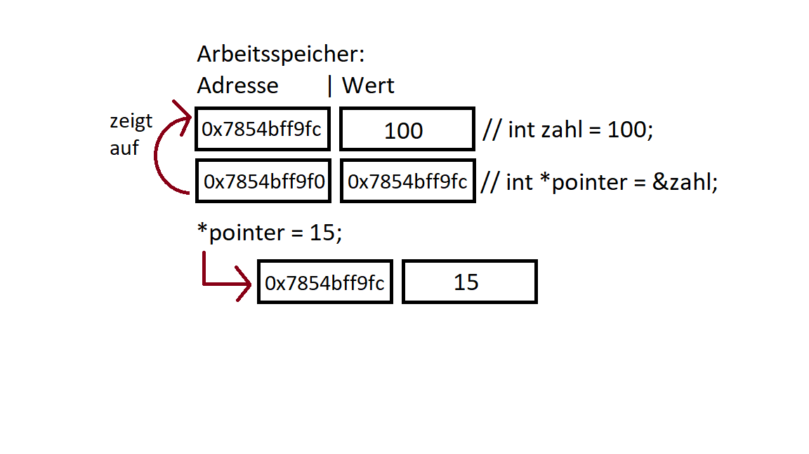

**[C++ Basics]{.underline}**

1.  Heap und Stack

> Heap und Stack sind Teile des Arbeitsspeichers. Auf den Stack können
> immer nur neue Daten obendrauf gelegt werden. Werden Daten wieder
> freigegeben, werden sie von oben nach unten wieder entfernt. Dieses
> Prinzip nennt sich LIFO („Last in, First out"). Durch seine Struktur
> kann der Stack sehr effizient verwaltet werden, weshalb
> Stack-Operationen auch sehr schnell sind.
>
> Jeder Thread eines Programmes erhält einen eigenen Speicherbereich mit
> fixer Größe für den Stack zugewiesen. Dort werden Informationen zum
> Programmablauf (z.B. Funktionsparameter) und lokale Variablen
> gespeichert. Beim Anlegen neuer lokaler Variablen (z.B. in einer
> Funktion) wächst der Stack und beim Verlassen des
> Sichtbarkeitsbereichs (z.B. beim Verlassen einer Funktion) schrumpft
> (Speicher wird freigegeben) der Stack entsprechend und der Speicher
> wird automatisch aufgeräumt.

Variable wird auf dem Stack angelegt.

Die Eigenschaften des Stacks sind also:

-   Begrenzte Größe

-   LIFO Datenstruktur (zuletzt angelegte Daten werden als erstes wieder
    freigegeben, deshalb auch „Stack" bzw. „Stapel)

-   Wächst und schrumpft mit dem Programmverlauf

-   Wird verwendet für lokale Variablen und Funktionsparameter

-   Kein explizites Freigeben des Speichers nötig

-   Das Ablegen und Entfernen von Elementen ist sehr effizient

> Der Heap ist nicht so strukturiert wie der Stack. Anders als der Stack
> kann der Heap bis zur Speichergrenze auf der Prozessebene anwachsen.
> Der Heap ist außerdem auch langsamer als der Stack. Auf dem Heap
> angelegter Speicher muss auch explizit freigegeben werden (durch den
> Programmiere oder z.B. den Garbage Collector, variiert nach
> Programmiersprache). Für den Zugriff auf den Heap werden Zeiger
> verwendet, auch wenn das nicht immer direkt ersichtlich ist. In Java
> und C# werden z.B. Referenzen für Objekte, die auf dem Heap liegen,
> verwendet. Intern wird jedoch immer noch mit Zeigern, welche die
> Speicheradresse des Objektes beinhalten, gearbeitet. Auf Objekte,
> welche auf dem Heap angelegt wurden, lässt sich global zugreifen, da
> sie nicht auf den lokalen Sichtbarkeitsbereich beschränkt sind (sofern
> ein Zeiger oder eine Referenz auf dieses Objekt vorhanden ist). In C++
> wird dynamischer Speicher auf dem Heap mit „new" erzeugt. Danach muss
> dieser dynamische Speicher jedoch explizit mit „delete" freigegeben
> werden. Das Zurücksetzen des Pointers beugt hier einem Zugriff auf
> bereits (durch delete) freigegebenen Speicher vor, denn „delete" setzt
> den Zeiger nicht auf NULL zurück.
>
> 
>
> Variable mit ‚new' auf dem Heap erstellen. Wert wird über den Pointer
> geändert, der auf diese Variable zeigt. Am Ende wird dieser dynamische
> Speicher mit ‚delete' wieder freigegeben.
>
> Die Eigenschaften des Heaps sind also:

-   Der Heap kann innerhalb der Prozessgrenze beliebig groß werden

-   Anlegen und freigeben von Objekten ist vergleichsweise langsam

-   Auf dem Heap angelegte Objekte können global verfügbar gemacht
    werden

-   In Programmiersprachen ohne Garbage Collector muss der Speicher
    manuell freigegeben werden, wenn er nicht mehr benötigt wird

Quellen: <https://lerneprogrammieren.com/stack-und-heap/>

2\. Output/ Input

Text auf der Konsole mit ‚cout' ausgeben.

Mit ‚cin' wird der Input des Users eingelesen.

Hier wird der User Input in die Variable ‚i' geschrieben und dann auf
der Konsole ausgegeben.

3\. Const und unsigned

Eine Konstante wird mit ‚const' erstellt. Konstanten werden gebraucht,
wenn die Variable im Programm nicht geändert wird (im Beispiel PI, da PI
einen festen Wert hat und nicht geändert werden muss).

„Unsigned"-Variablen verzichten auf den negativen Bereich, da bei
„normalen"(signed) Variablen die Hälfte des Speicherplatzes für den
negativen Bereich draufgeht. Der Wertebereich eines signed 32-bit
Integers reicht von -2,147,483,648 bis 2,147,483,647, bei einem unsigned
32-bit Integers reicht dieser Wertebereich jedoch von 0 bis
4,294,967,295. In dem Code wird für ‚k' das Maximum des unsigned 32-bit
Integers ausgegeben, da -1 außerhalb der Reichweite eines unsigned
32-bit Integers liegt, weshalb er auf das Maximum des unsigned 32-bit
Integers springt.

In C++ lassen sich diese Grenzen auch mit schon in C++ existierenden
Konstanten abfragen, weshalb Code wie dieser hier

auch ‚true' bzw. 1 zurückgibt.

Quellen:
<https://docs.microsoft.com/de-de/cpp/cpp/data-type-ranges?view=msvc-170>

4\. Variablen

In diesem Beispiel kann man sehen, wie eine globale Variable(x) mit 5
initialisiert wird und an zwei verschieden Stellen um 1 inkrementiert
wird. Nach dem die globale Variable an beiden Stellen inkrementiert
wurde ist x = 7.

Hier wird ein Alias für eine Variable (x) erstellt. Der Alias wird mit
einem ‚&' erstellt. Jetzt kann man über y und x auf ein und dieselbe
Stelle im Arbeitsspeicher zugreifen.

Mit dem ‚static' Keyword können lokale Variable erstellt werden die,
nachdem der Block, in dem die Variable deklariert wurde, den
Gültigkeitsbereich verlässt immer noch im Speicher vorhanden ist.

Deswegen ist der Ouput des Beispielscodes auch:

Möchte man Zufallszahlen in C++ generieren benötigt man einen
sogenannten ‚Seed' wofür meistens die aktuelle Systemzeit (‚time(0)')
genutzt wird. Mit dem Aufruf von ‚rand()' wird dann eine Zufallszahl
generiert. Mit dem Modulo Operator kann man den Bereich der generierten
Zufallszahl auch noch beschränken.

‚C-Style' Cast:

Der ‚C-Style' Cast ist ein Cast, der in C++ und C funktioniert, in C++
jedoch nicht empfohlen wird, da es bessere Alternativen (wie
‚static_cast' gibt) gibt.

Static Cast:

Der ‚static_cast' wandelt Datentypen ineinander um. Dabei steht in den
spitzen Klammern ‚\<\>' immer in was das Quellobjekt, welches in den
Klammern ‚()' steht, gecastet werden soll.

Const Cast:

Mit ‚const_cast' kann die Konstantheit eines Objektes aufgehoben werden,
wobei das Objekt \[trotz der aufgehobenen Konstantheit\] nicht verändert
werden sollte.

Aufgebaut ist der ‚const_cast' wie folgt: In den ‚\<\>' steht, zu was
man casten will und in den den ‚()' steht, was gecastet werden soll.

Im Beispiel erwartet die Funktion einen Zeiger auf einen
nicht-konstanten String, wobei der zu übergebene String jedoch konstant
ist und in der Funktion auch nicht geändert wird. Daher kann man beim
Funktionsaufruf mit ‚const_cast' die Konstanz des konstanten Zeigers
entfernen, um ihn der Funktion übergeben zu können. (Der auskommentierte
Funktionsaufruf würde nicht funktionieren, da dort versucht wird, einen
konstanten Zeiger zu übergeben, wobei die Funktion einen
nicht-konstanten Zeiger erwartet)

Quellen:
<https://de.wikibooks.org/wiki/C%2B%2B-Programmierung/_N%C3%BCtzliches/_Casts>

5\. Funktionen

In dem Beispiel kann man den Aufbau einer Funktion, sowie die Überladung
der ‚print'-Funktion sehen.

In C++ sind Funktion wie folgt aufgebaut: Zuerst folgt der Rückgabewert
(‚void', falls nichts zurückgegeben werden soll), dann der Name der
Funktion und in den Klammern optionale Parameter, die beim
Funktionsaufruf als Argumente übergeben werden müssen.

Da die ‚print'-Funktion überladen ist, kann man einen int oder double
als Argument übergeben.

Die ‚add'-Funktion nimmt zwei Integer als Argument und gibt das Ergebnis
der Addition beider Integer zurück.

Sollten die Funktionen nach der ‚main'-Funktion deklariert werden
benötigt man ‚Funktionsprototypen', um die Funktionen nutzen zu können.
Diese Funktionsprototypen geben den Rückgabewert, den Funktionsnamen und
die Parametertypen der Funktion an.

oder

Standardparameter in C++ werden dem Argument zugewiesen sollte beim
Funktionsaufruf kein spezieller Wert für das Argument übergeben worden
sein. Dies lässt sich direkt in der Deklaration der Funktion oder in dem
Funktionsprototypen machen.

6\. Referenzen

„Problem":

Der Ziel des Codes sollte es sein den Wert einer Variable in einer
Funktion zu ändern, jedoch wird in dem Beispiel oben nur der Wert der
Variable („call by value") übergeben, dann in ‚a' gespeichert und dann
wird a inkrementiert, jedoch nicht x, die Variable, die wir eigentlich
inkrementieren wollten.

„Lösung":

Dieser Code ist die Lösung für das oben präsentierte Problem. Hier steht
ein ‚&' vor dem Parameter, was bedeutet, dass man eine Referenz erwartet
(„call by reference"). Über die Referenz lässt sich x innerhalb der
Funktion ‚funktion' ändern, da keine Kopie des Wertes des Argumentes
erstellt wird, sondern der Wert des Argumentes direkt über die Referenz
geändert wird.

Hier eine Visualisierung des Problems/der Lösung:

{width="6.8902777777777775in"
height="6.967361111111111in"}

In dem Diagramm kann man sehen, dass beim „Call/pass by reference" die
Speicheradresse des Argumentes übergeben wird, anstatt nur der Wert.

Bild: <https://www.programiz.com/cpp-programming/pointers-function>

7\. Headerdateien

Headerdateien enthalten die Deklaration (und manchmal auch schon die
Implementation bzw. Initialisierung) von z.B. Funktionen oder Variablen.
Headerdateien enden auf .h und werden mit ‚#inlcude"Headerdatei"'
eingebunden.

Verwendet wird die Headerdatei im C++ Code wie folgt:

Möchte man in einer Headerdatei nun Variablen von einer Datei verwenden,
in der man die Headerdatei nutzt, lässt sich dies mit dem Keyword
‚extern' machen. Hier ein Beispiel einer solchen Headerdatei:

Die Funktion aus der Headerdatei kann in der ‚main.cpp' wie folgt
verwendet werden:

Hier wird eine globale Variable ‚z' initialisiert. Der Aufruf von
‚funktion' gibt ‚5' aus, weil die Headerdatei mit dem ‚extern' Keyword
erkennt, dass es eine Variable ‚z' in dem Programm gibt, welches die
Headerdatei verwendet.

8\. Schleifen

In diesem Beispiel Code kann man die drei Schleifenarten ‚while', ‚for'
und ‚do-while' sehen. Sie sind genau so aufgebaut wie in Java.

9\. Arrays und Strings

In diesem Beispielcode wird ein Array von der Größe von 100 Integern auf
dem Stack erstellt und zuerst nur mit 0 initialisiert, da in den
geschweiften Klammern keine spezifische Werte angegeben wurden. Später
in der ‚for'-Schleife wird auf eine spezielle Stelle des Arrays über den
Index ‚i' zugegriffen und dieser Stelle wird der Wert von ‚i' zugewiesen
und dann auf der Konsole ausgegeben.

Wichtig: Da der Array mit einer festen Größe auf dem Stack erstellt
wurde, darf man nicht versuchen auf einen Index außerhalb der
festgelegten Größe des Arrays zugreifen, da dies eine zufällige Stelle
im Arbeitsspeicher ausgeben/überschreiben könnte. Daher ist auch der
Output des Codes:

661160040 // zahlen\[150\] zeigt auf irgendeinen Wert im Arbeitsspeicher

100 // Mit zahlen\[150\] = 100 kann diesen Wert überschreiben, falls
dieser Wert gebraucht wird kann das im schlimmsten Fall zum Stopp des
Programms führen

#include \<iostream\>\
#include \<cstring\>\
\
int main() {\
\
char string\[\] = \"Hello World!\"; // 0 Byte am Ende -\> 0 Byte !=
Zeichen \"0\"\
char string2\[128\] = \"Test\";\
\
int cmp = strcmp(string, string2);\
\
int length = strlen(string); // 0 Byte wird benötigt, damit diese
Funktion weiß, wann der String endet\
\
std::cout \<\< \"Laenge von \" \<\< string \<\< \": \" \<\< length \<\<
std::endl;\
std::cout \<\< \"String compare von \" \<\< string \<\< \" und \" \<\<
string2 \<\< \": \" \<\< cmp \<\< std::endl; // 0 = gleich, sonst \< 0
oder \> 0\
std::cout \<\< \"Zusammenfuegen von \" \<\< string \<\< \" und \" \<\<
string2 \<\< \": \" \<\< strcat(string, string2) \<\< std::endl;\
strcpy(string2, string);\
std::cout \<\< \"Inhalt von String 2 (wurde aus String kopiert): \" \<\<
string2 \<\< std::endl;\
\
system(\"pause\");\
\
return 0;\
}

Hier kann man C-Strings sehen, welche in C++ jedoch nicht empfohlen
werden, da es eine bessere Alternative gibt. Ein C-String ist ein Array
aus verschiedenen Zeichen, wobei der Compiler am Ende der Zeichenkette
noch ein ‚0 Byte' hinzufügt, damit er weiß, wann das Ender der
Zeichenkette ist. Das gefährliche bei C-Strings ist, dass sie (da sie
Arrays sind) eine feste ‚Größe' bzw. ‚Länge' haben und diese nicht
‚überschritten' werden darf, wobei sowas aber bei Funktionen wie z.B.
‚strcpy' zur Laufzeit passieren kann, da der Source String länger als
der Destination String sein kann und somit einen ‚Buffer Overflow'
auslösen kann. Hier ist eine Visualisierung eines Buffer Overflows:

{width="6.8902777777777775in"
height="2.6509437882764653in"}

Hier kann man sehr gut sehen, was ein Buffer Overflow ist. Man hat einen
Buffer (z.B. den C-String) und versucht in diesen etwas
hereinzuschreiben (wie z.B. ‚USERNAME12'), jedoch ist der Buffer (bzw.
der C-String) nicht groß genug (z.B. ist er nur 8 anstatt 10 Bytes groß)
und so ‚fließt' er aus dem Buffer (bzw. dem C-String).

#include \<iostream\>\
#include \<string\>\
\
int main() {\
\
std::string string = \"Hello World!\";\
std::string string2 = string; // Kopie\
std::string string3(\"Test\"); // int zahlen(40);\
std::string string4(10, \'a\'); // 50mal a

std::string userInput;\
std::string empty; // String wird schon hier erstellt/ Muss nicht wie in
Java noch mit \'new\' instanziiert werden

int length = string.length();\
\
std::cout \<\< \"Laenge von \" \<\< string \<\< \": \" \<\< length \<\<
std::endl \<\< string2 \<\< std::endl \<\< string3 \<\< std::endl \<\<
string4 \<\< std::endl;\
\
std::string a = \"Hello \";\
std::string b = \"World!\";\
std::string ab = a + b;\
\
std::cout \<\< ab \<\< std::endl;\
\
std::string zusammenfuegenVonPrimitivenDatentypen = std::to_string(10) +
std::to_string(10.5); // Primitive Datentypen müssen zuerst in einen
String gewandelt werden\
\
std::cout \<\< zusammenfuegenVonPrimitivenDatentypen \<\< std::endl;\
\
if(a == b){ // \< und \> funktionieren auch; Außnahme: Ä, Ö, Ü\
std::cout \<\< \"A und B sind gleich!\" \<\< std::endl;\
}else{\
std::cout \<\< \"A und B sind nicht gleich!\" \<\< std::endl;\
}\
\
std::string original = \"World!\";\
std::string anfang = \"Hello \";\
original.insert(original.length(), anfang);\
\
std::cout \<\< original \<\< std::endl;\
\
original.erase(6, 6);\
std::cout \<\< original \<\< std::endl;\
\
std::string satz = \"Lorem ipsum Lorem ipsum Lorem ipsum Lorem ipsum\";\
int first = satz.find(\"Lorem\"); // Von links suchen; Wenn nichts
gefunden wurde -\> -1\
int last = satz.rfind(\"Lorem\"); // Von rechts suchen\
std::cout \<\< \"Index erstes Lorem: \" \<\< first \<\< \" Index letztes
Lorem: \" \<\< last\<\< std::endl;\
\
string\[4\] = \'Z\'; // Gefährlich, Index kann über Länge des String
reichen und Sachen im Arbeitsspeicher überschreiben\
std::cout \<\< \"Manipulierter String: \" \<\< string \<\< std::endl;\
\
// string.at(400) = \'Z\'; // Bessere Alternative -\> Zu hoher Index =
Programm stürzt ab

std::getline(std::cin, userInput);\
std::cout \<\< userInput \<\< std::endl;

system(\"pause\");\
\
return 0;\
}

Dazu gibt es jedoch noch eine bessere Variante Strings zu erstellen und
das sind die C++ Strings (std::string). Im Code oben kann man einige
Methoden, die mit dem C++ String verwendet werden können, sehen. Der C++
String ist relativ gleich zu dem String in Java, dennoch gibt es auch
hier (wie bei den C-Strings) eine kleine ‚Schwachstelle' und das wäre
das Zugreifen mit ‚\[\]' auf einen zu hohen Index, was dann dafür sorgt,
dass ein zufälliger Wert im Arbeitsspeicher überschrieben wird. Besser
ist es hier die ‚.at(index)'-Methode zu verwenden, da diese zur Laufzeit
einen Fehler schmeißt, falls der Index ‚out of range' ist, was besser
ist als das Programm zur Laufzeit zu ‚zerstören'. Am Ende fällt
vielleicht auf, dass anstatt ‚cin' ‚getline' für User Input benutzt
wird, was daran liegt, dass ‚cin' einen Abstand als Terminator sieht und
man so keine Wörter/Sätze mit Abständen eingeben kann. Mit der ‚getline'
Funktion geht dies jedoch und der User Input lässt sich auch direkt in
einen String/eine Variable schreiben.

10\. Weiteres

Hier kann man ein Switch-Case sehen, was genau
wie in Java funktioniert (case, default, break, es gibt Fallthroughs).

Hinter dem ‚case' steht die Bedingung, man benötigt immer ein ‚break'
(außer für ein Fallthrough) und falls keiner der Fälle eintritt kann man
dies auch mit ‚default' abfangen.

Für mathematische Funktionen kann man die C- und C++- Mathebibliotheken
verwenden.

Hier kann man 2 Headerdateien sehen, die sich
gegensteig inkludieren. Doch, damit das funktioniert werden
‚Includeguards' benötigt, welche darauf achten, dass sich die
Headerdateien nicht unendlich oft inkludieren, sondern nur einmal. Dies
machen sie mit Makros und bedingter Kompilierung.

‚#pragma once' ist eine weitere Art eine
Headerdatei in einer anderen Headerdatei, die diese Headerdatei
inkludiert, zu inkludieren. Jedoch ist ‚#pragma once' kein Standard und
deshalb muss es nicht jeder Compiler haben. Dafür brauch man in der
anderen Headerdatei nur die Headerdatei mit ‚#pragma once' inkludieren.

11\. Makros und der Präprozessor

Um Makros zu verstehen ist wichtig zu wissen, was im Hintergrund
passiert, wenn man das Programm ausführt:

Zuerst kompiliert der Compiler den C++ Code in für Maschinen lesbaren
Code. Dieser, für Maschinen lesbare Code, steht dann in OBJ-Dateien und
muss noch zusammengefügt werden, worum sich der Linker kümmert. Der
Linker fügt dann alles so zusammen, dass es am Ende eine .exe Datei
gibt. Vor dem Kompilieren geht der Präprozessor aber nochmal über den
Code und verändert ihn, meistens indem er Anweisungen kopiert und an
anderer Stelle wieder einfügt. Präprozessor Befehle erkennt man daran,
dass sie mit einem Rauten Symbol ‚#' anfangen.

Ein Code der also so aussieht, wird vor dem Kompilieren von dem
Präprozessor zu folgendem Code geändert:

Makros können außerdem schon das Semikolon enthalten und somit wird dies
nicht beim Makroaufruf benötigt. Durch Makros kann man lange Statements,
die man öfters benötigt, auch sehr gut abkürzen. Somit kann man sich
z.B. das Ausgeben auf der Konsole erleichtern, was öfters bei größeren
Projekten wie einer Game Engine wichtig ist, da Logging dort eine große
Rolle spielt:

Außerdem kann man mit ‚\\' einen Zeilenumbruch ‚erzeugen' um einen
mehrzeiligen Makro zu erzeugen

#include \<iostream\>\
\
#define MAIN int main() \\\
{\\\
std::cout \<\< \"Hello World\" \<\< std::endl;\\\
}\
\
MAIN

Möchte man ein Makro ‚undefinieren' (Definition des Makros wird
entfernt) kann man das mit ‚#undef' machen, was im Code wie folgt
aussieht (Beim 2. Aufruf von der ‚GEHEIMZAHL' gibt es einen Fehler, da
der Präprozessor die Definition für ‚GEHEIMZAHL' nicht mehr kennt und
daher nicht weiß womit er ‚GEHEIMZAHL' ersetzen
soll):

Quellen:
<https://www.youtube.com/watch?v=A6IHJVMzulg&ab_channel=Pilzschaf>,
<https://www.youtube.com/watch?v=j3mYki1SrKE&ab_channel=TheCherno>,<https://docs.microsoft.com/de-de/cpp/preprocessor/hash-undef-directive-c-cpp?view=msvc-170>

12\. Bedingte Kompilierung

Bedingte Kompilierung lässt den Nutzer, je nach Bedingung
Quelltextblöcke ein oder ausschließen. Mit #ifdef(,#elif) und #endif
kann man Bereiche von Code eingrenzen, die nur kompiliert werden sollen,
wenn ein bestimmter Makro vorher definiert wurde, was dann ungefähr so
aussieht:

In dem Beispiel wird der ‚WIN'-Makro mit einer 1 definiert und später
frage ich auch den Wert dieses Makros ab um dann den entsprechenden Code
auszuführen.

Ein sinnvoller Einsatz wäre:

Hier wird ‚Hello World' nur ausgegeben, wenn der ‚DEBUG_MODE' definiert
ist. Sowas ist nützlich, wenn man ein großes Projekt hat, wo debuggen
wichtig ist, was man dann aber auch veröffentlichen möchte, wo dann
keine Infos auf der Konsole ausgegeben werden sollen, was man damit
erreicht, dass man den Wert von ‚DEBUG_MODE' auf ‚0' setzt.

Der folgende Code zeigt eine weitere nützliche Präprozessordirektive,
die #error-Anweisung. Sie ist da, um den Entwickler früh vor einer
Programminkonsistenz oder einen Verstoß gegen eine Einschränkung zu
informieren, was in diesem Fall das Doppelte definieren eines
Betriebssystems ist.

13\. Pointer

{width="7.363194444444445in"
height="3.4025984251968504in"}

Pointer (bzw. Zeiger) zeigen auf einen Speicherplatz im RAM. An diesem
Speicherplatz können Variablen, Objekte etc. liegen. In dem Beispiel
wird eine Variable auf dem Stack mit ‚int zahl = 100;' erstellt. Der
Pointer ‚pointer' welcher mit ‚int \*pointer = &zahl;' erstellt wird,
zeigt dann auf den Speicherort dieser Variable. Mit ‚&' wird die Adresse
einer Variable ermittelt, was in dem Fall benutzt wird um dem Pointer
mitzuteilen an welcher Speicheradresse die Variable liegt. Möchte man
nun wissen, worauf der Pointer zeigt (also auf welche Adresse), kann man
das einfach machen in dem man ‚pointer' ausgibt. Den Wert hinter der
Adresse auf den der Pointer zeigt kriegt man mit ‚\*pointer' heraus.

Hier ein kleines Beispielprogramm, was gut ist um ein Grundverständnis
für die Funktionsweise von Pointern zu entwickeln:

Ein sinnvolles Beispiel für Pointer wäre das Verwalten von dynamischem
Speicher:

Da Pointer alles referenzieren können, können sie auch auf weitere
Pointer referenzieren, was dann wie folgt aussieht:

(Pointer auf einen Pointer auf einen Pointer)

Quelle: <https://manderc.com/operators/pointerarithmetic/index.php>

13.1. Pointer-Arithmetik

Die Pointer-Arithmetik spezifiziert spezielle Verhaltensregeln bei
Additions-, Subtraktions-, Zuweisungs- und Vergleichs-Operatoren. Hier
ein Beispiel zur Addition mit einem Pointer:

Hier wird der Anfang des Arrays ‚zahlen' in einem Pointer ‚anfang'
gespeichert. Dieser Pointer wird in einer For-Schleife inkrementiert.
Dies zeigt dann (vom Anfang des Arrays) auf die Stelle ‚i' des Arrays.
Der Stelle ‚i' des Arrays ‚zahlen' wird dann der Wert von ‚i'
zugewiesen. Der Output gibt dann die Zahlen von ‚0-99' aus. Der Array
wurde mit Hilfe von Pointer-Arithmetik gefüllt und letztendlich
ausgelesen.

13.2. Null-Pointer

Pointer werden auf null (NULL (Makro für 0) bzw. 0) gesetzt, um zu
zeigen, dass sie auf nichts zeigen. Dies lässt sich gut mit ‚0' und/oder
‚NULL' machen, jedoch ist die neuste und beste Variante einen Pointer
auf null zu setzen ‚nullptr'. Hier ein kleines Beispielprogramm zu
Null-Pointer:

Einige Vorteile von ‚nullptr' sind:

\- Vom Typ ‚std::nullptr_t' -\> Kein Integer

\- Keyword welches eine Null-Pointer Konstante spezifiziert

\- Hat (anders als ‚NULL') keine Probleme implizit in 0 (bzw. einen
Integer) bei z.B. einem Funktionsaufruf gecastet zu werden.

Quelle:
<https://learn.microsoft.com/de-de/cpp/cpp/nullptr?view=msvc-170>

13.3. Casten von Pointern

Hier wird der Wert, auf den der Pointer ‚pA' zeigt, zu einem Integer mit
einem ‚static_cast' gecastet.

13.4. Void Pointer

Void Pointer haben keinen ihnen zugewiesenen Datentypen. Sie können die
Adresse eines Typen halten/ auf irgendeinen Datentypen im RAM zeigen,
jedoch können sie diesen Wert nicht ändern. Ein Void Pointer lässt sich
in jeden Datentypen casten.

In diesem Programm zeigt ein Void Pointer auf einen Float. Den Wert
dieses Floats kann der Void Pointer nicht ändern, jedoch kann man diesen
Void Pointer in einen Float Pointer casten und den Wert des
referenzierten Floats über den Float Pointer ändern.

13.5. ‚Const' bei Pointern

‚const' bei Pointern kann dafür sorgen, dass:

\- der referenzierte Wert nicht geändert werden darf, die Referenz
selbst darf jedoch geändert werden

\- der referenzierte Wert geändert werden darf, die Referenz selbst darf
jedoch nicht geändert werden

\- die Referenz und der referenzierte Wert nicht geändert werden
dürfen

13.6. Funktionspointer

Funktionspointer verweisen auf die Adresse einer aufzurufenden Funktion.
Um einen Funktionspointer zu erstellen, muss man den Rückgabetypen und
die Parameter der Funktion angeben, sowie den Namen des
Funktionspointers. Hier ein Beispielprogramm:

14\. Dynamischer Speicher

In C++ erstellt man mit dem ‚new'-Keyword, anders als in Java,
dynamischen Speicher. Dieser Speicher wird dann auf dem Heap reserviert.
Dynamischen Speicher zu nutzen ist sinnvoll, falls etwas wie ein Array
zur Laufzeit (durch z.B. Benutzereingabe) erstellt wird. Dynamischer
Speicher wird mit Pointer verwaltet. Außerdem muss Dynamischer Speicher
später auch freigegeben (‚gelöscht') werden. Hier ein Beispielprogramm:

#include \<iostream\>\
\
int main() {\
\
int \*p = new int; // Pointer zeigt auf dynamische Variable im
Arbeitsspeicher\
\
\*p = 10;\
\
std::cout \<\< \*p \<\< std::endl;\
\
delete p;\
\
int k = 0;\
std::cin \>\> k;\
\
int \*array = new int\[k\]; // Wird nicht zur Compilezeit erstellt,
sondern zur Laufzeit\
array\[0\] = 15;\
std::cout \<\< array\[0\] \<\< std::endl;\
\
delete\[\] array;\
\
system(\"pause\");\
\
return 0;\
}

In diesem Beispielprogramm wird zuerst ein Pointer auf einen Integer,
für den auf dem Heap Speicher reserviert wird, erstellt. Dann wird über
diesen Pointer dem dynamischen Speicher auf dem Heap ein Wert (10)
zugewiesen. Danach wird dieser Speicher wieder mit ‚delete' freigegeben.
Das selbe wird dann mit dem Array ‚array' gemacht, wobei man für das
Freigeben von Arrays kein ‚delete' sondern ‚delete\[\]' benutzt.

‚malloc' und ‚free' sind die C Varianten von ‚new' und ‚delete'.
‚Delete' und ‚free' sind sich sehr ähnlich, da man bei beiden den
freizugebenen Speicher zum Freigeben angibt. Jedoch muss man bei
‚malloc' (um dynamischen Speicher zu erstellen) die Größe des zu
reservierenden Speichers ‚manuell' mit ‚sizeof' angeben. In diesem
Beispielprogramm wird Speicher für 10 Integer reserviert und dann in
einen Integer Pointer gecastet, da ‚malloc' einen Void Pointer auf den
reservierten Speicher zurückgibt:

